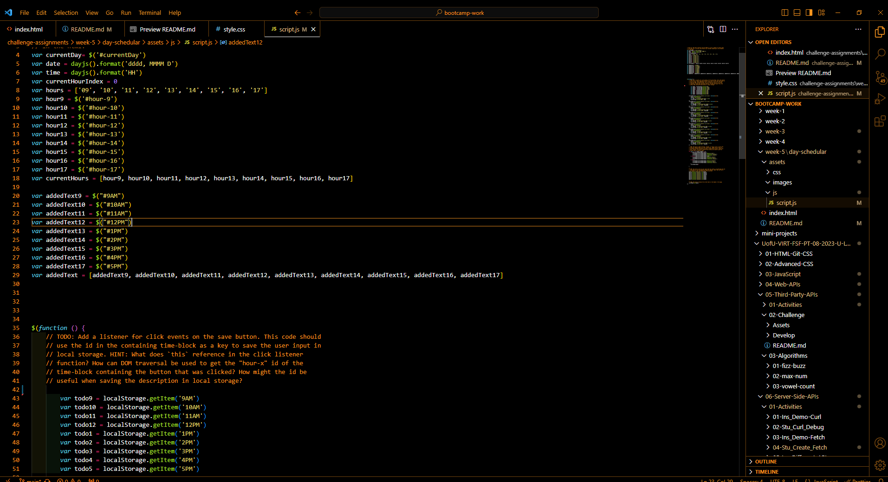
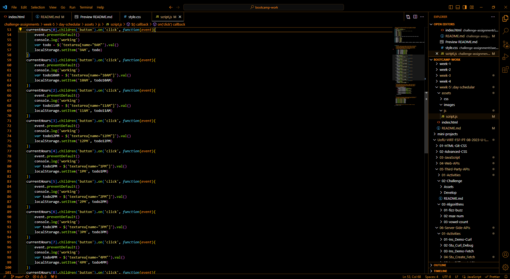
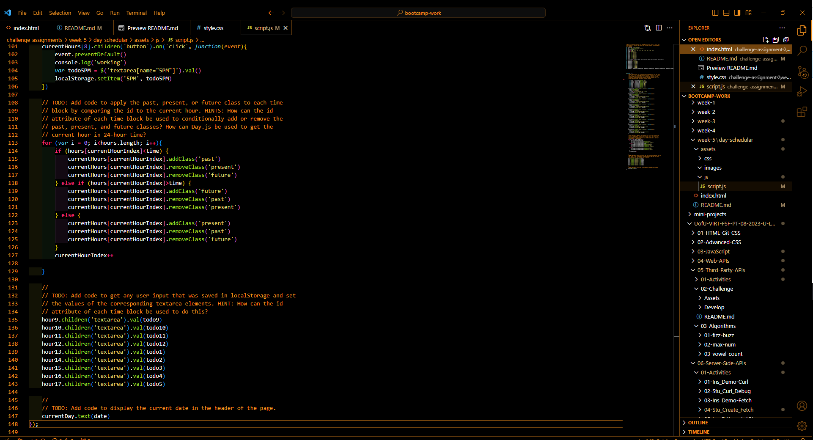

# day-schedular

## Description
This application is day schedular. It was made as a way to plan out your day. I built this application to strengthen my skills with third party APIs like jquery and Dayjs. It saves your schedule until you go in and save it yourself. I learned better ways to implement event listeners and other function within the Script.js

## Usage
To use this application you are are going to want to add items to do in the time blocks and save them. Once they are saved they are going to be saved until you go in and change them themselves.

[Link to Application](https://aidanlewis203.github.io/day-schedular/)

